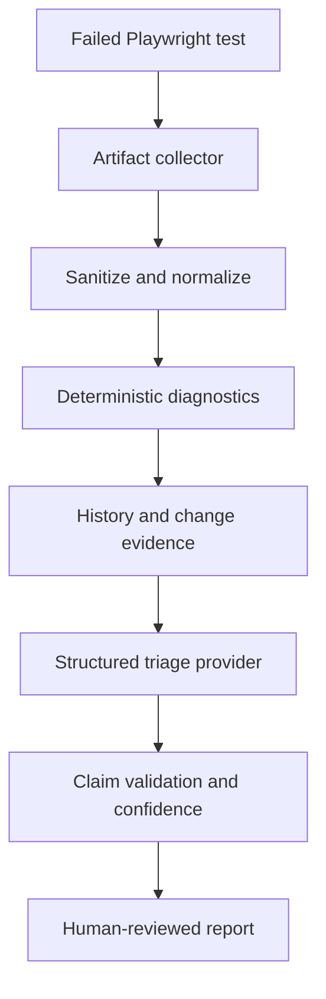

# AI Test Failure Triage Agent

[](https://github.com/ashokmanohar-ai/ai-test-failure-triage-agent/actions/workflows/ci.yml)
[](https://www.python.org/)
[](https://playwright.dev/)
[](LICENSE)

An enterprise-style AI-assisted Quality Engineering framework that correlates
Playwright failures, traces, screenshots, console errors, network evidence,
environment health, test history and code changes to classify failures and
recommend evidence-based next actions.

> Evidence first, AI second. The framework never turns a failed test green,
> changes automation autonomously, or presents model confidence as truth.

## Business problem

Large suites produce more failures than engineers can investigate promptly.
The expensive part is repeatedly collecting and correlating evidence before a
failure can be routed. This project makes that correlation reproducible while
leaving final ownership and code changes with engineers.

## Key features

- Structured Playwright JSON ingestion with screenshot and trace registration
- Console, network, environment-health, history and Git-change correlation
- Deterministic diagnostics before any model call
- Explicit evidence for and against every proposed classification
- Transparent four-component confidence indicator and `UNKNOWN` handling
- Stable normalized signatures and SQLite historical intelligence
- Mock, Azure OpenAI and OpenAI-compatible provider abstraction
- Pydantic-validated output and unsupported-claim post-checks
- Secret/PII masking, prompt-injection labelling and workspace path enforcement
- Console, JSON, HTML and failure-preserving JUnit reports
- 80 sanitized controlled evaluation cases with precision, recall, F1,
  confusion matrix, calibration bins and quality gates
- FastAPI, CLI, Docker Compose, OpenTelemetry-ready boundaries and GitHub Actions
- Local Playwright app with eight reproducible failure profiles

## Architecture



The provider receives a typed `FailureEvidence` record, not a pasted exception.
See [architecture](docs/architecture.md) and [evidence model](docs/evidence-model.md).

## Failure taxonomy

`PRODUCT_DEFECT`, `AUTOMATION_DEFECT`, `FLAKY_TEST`, `TEST_DATA`,
`ENVIRONMENT`, `NETWORK`, `API_BACKEND`, `AUTHENTICATION`, `DEPENDENCY`,
`BROWSER`, `PERFORMANCE_TIMEOUT`, `ASSERTION_DEFECT`, `CONFIGURATION`, and
`UNKNOWN`. Subcategories preserve technical specificity such as
`LOCATOR_CHANGED`, `SESSION_EXPIRED`, and `HTTP_5XX`.

## Quick start — offline mock mode

```bash
python3.12 -m venv .venv
source .venv/bin/activate
python -m pip install -e '.[dev]'
export MODEL_PROVIDER=mock
uvicorn app.main:app --reload
```

Open `http://localhost:8000/docs`. No LLM credentials are required.

Analyze a typed fixture:

```bash
triage-agent analyze --artifact fixtures/evidence/api-01.json --provider mock
```

Analyze a Playwright JSON reporter file:

```bash
triage-agent analyze --artifact playwright-demo/playwright-report.json --playwright --provider mock
```

Generated JSON, HTML and JUnit files appear under `reports/`.

## API

| Method | Endpoint | Purpose |
|---|---|---|
| `POST` | `/api/v1/failures` | Store normalized evidence |
| `POST` | `/api/v1/import/playwright` | Import a report from the configured artifact root |
| `POST` | `/api/v1/failures/{id}/triage` | Run evidence-first triage |
| `GET` | `/api/v1/failures/{id}` | Retrieve evidence |
| `GET` | `/api/v1/failures/{id}/timeline` | Retrieve correlated events |
| `GET` | `/api/v1/failures/{id}/report` | Render the reviewed HTML report |
| `GET` | `/api/v1/health` | Service/provider health |

## Playwright controlled failures

```bash
cd playwright-demo
npm ci
npx playwright install --with-deps chromium
npm test
FAILURE_PROFILE=api_500 npm test          # intentionally exits failed
FAILURE_PROFILE=locator_change npm test   # intentionally exits failed
```

Available profiles: `locator_change`, `product_defect`, `api_500`,
`environment_down`, `invalid_test_data`, `flaky_timing`, `auth_expired`, and
`slow_endpoint`. They generate real local artifacts; the committed evaluation
fixtures are explicitly sanitized synthetic cases, not claimed executions.

## Deterministic diagnostics

Rules independently identify high-value signals: 401/403 and session expiry,
5xx requests, down health checks, browser termination, locator cardinality,
timeout type, expected/actual mismatches, invalid data state, and multi-signal
flakiness. A retry pass alone is deliberately insufficient. Details are in
[deterministic diagnostics](docs/deterministic-diagnostics.md).

## AI triage and providers

`MODEL_PROVIDER=mock` is deterministic and is the only provider used by CI.
It validates orchestration, not real-model triage quality. Optional providers
are configured exclusively through environment variables documented in
`.env.example`. Prompt version and provider/model names are recorded in output.

## Confidence model

The reported indicator combines deterministic evidence (40%), historical
evidence (25%), cross-evidence agreement (20%), and provider signal (15%).
`HIGH` begins at 0.85, `MEDIUM` at 0.65. This is not claimed to be a probability.
High confidence permits an auto-route *suggestion* only. See
[confidence model](docs/confidence-model.md).

## Flaky-test analysis

The configurable indicator uses retry recovery, pass/fail history, same
commit/environment context, signature variability and absence of relevant
changes. Consistent failures after a code change are protected from false
flaky classification. See [flaky analysis](docs/flaky-test-analysis.md).

## Historical signatures

Stable SHA-256 signatures combine test ID, normalized error, locator, endpoint,
HTTP outcome and browser. UUIDs, timestamps and contextual numeric IDs are
normalized without deleting status codes or endpoint meaning. Historical
classification is evidence, never copied blindly.

## Reports and evaluation

```bash
python scripts/run_evaluation.py
```

The 80-case dataset spans automation, product, backend, environment, test data,
flaky, authentication and intentionally unknown evidence. Metrics include
accuracy, per-category precision/recall/F1, confusion matrix, root-cause fact
recall, high-confidence accuracy and calibration bins. Baselines and gates are
versioned in `config/evaluation.yaml`. See [evaluation strategy](docs/evaluation-strategy.md).

## Security

All imported evidence is untrusted. Sensitive headers and inline credentials
are masked before persistence/model use; optional PII redaction covers email and
phone patterns; prompt-like log strings are labelled as data; artifact paths
must remain below an approved root; recommendations are checked against unsafe
commands; and model references to absent API endpoints are flagged. See
[SECURITY.md](SECURITY.md) for limitations and reporting.

## Observability

The runtime emits structured JSON logging across the request boundary. The
service has explicit stage boundaries suitable for OpenTelemetry spans and
Phoenix-compatible export. Provider/model, duration, evidence count,
classification, tokens and estimated cost are designed as reportable metadata;
provider token/cost capture depends on the selected remote API.

## CI/CD

CI runs Ruff, formatting, MyPy, Python tests, the mock evaluation gate, Node
lint/typecheck, a passing Playwright baseline, security checks and Docker build.
A separate workflow deliberately runs a controlled failing Playwright profile,
uploads its artifacts, runs triage with `if: always()`, and keeps the original
test job failed. See [CI/CD](docs/ci-cd.md).

## Docker

```bash
docker build -t ai-test-failure-triage-agent .
docker compose up --build -d
curl http://localhost:8000/api/v1/health
```

The container runs non-root, drops Linux capabilities, uses a read-only root
filesystem in Compose and requires no external model in default mode.

## Limitations and roadmap

- Screenshot OCR/vision analysis is intentionally optional; core triage works without it.
- Playwright trace ZIPs are registered and linked; undocumented trace internals are not reverse engineered.
- SQLite is the default reference store; a production deployment should add a PostgreSQL repository implementation.
- Confidence requires calibration against organization-specific labelled failures.
- Selenium, Cypress, Pytest, Jira and Azure DevOps adapters are extension points, not fake connectors.

Roadmap priorities are real Playwright attachment-body correlation, PostgreSQL,
RBAC/audit persistence, organization-specific calibration, OpenTelemetry
exporter configuration and reviewed work-item routing.

## Interview walkthrough

Use [the prepared 2-minute and 5-minute walkthrough](docs/interview-walkthrough.md)
to demonstrate the evidence model, deterministic-first rationale, product vs
automation reasoning, unknown handling, confidence limitations and CI design.

## Contributing and license

See [CONTRIBUTING.md](CONTRIBUTING.md). Security-sensitive reports should follow
[SECURITY.md](SECURITY.md). Released under the [MIT License](LICENSE).
