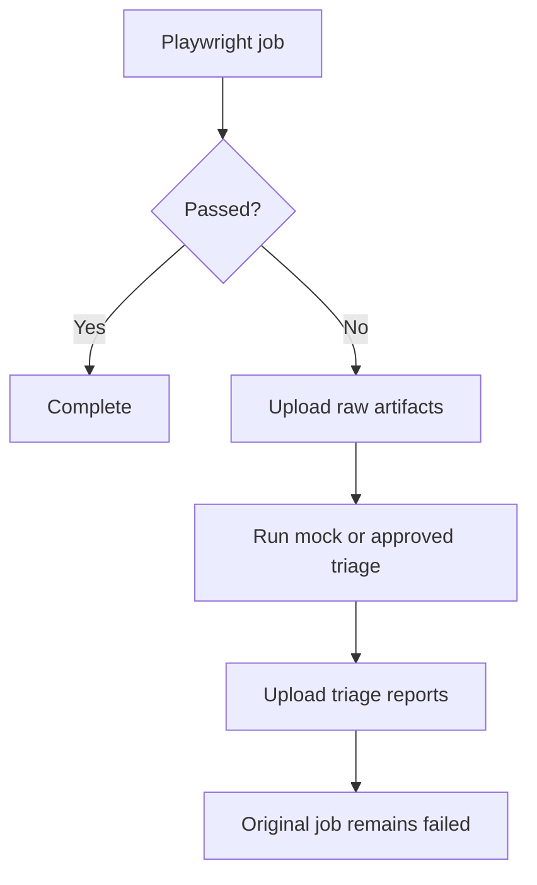

# CI/CD integration

GitHub Actions examples are executable. In Jenkins, archive the Playwright JSON,
trace and screenshot, then invoke the CLI in a `post { failure { ... } }` block.
In Azure DevOps, publish the same artifacts from an `always()` diagnostic step
while leaving the Playwright task result unchanged. External provider calls
should use environment-scoped secrets and organizational data policies.

